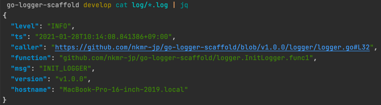
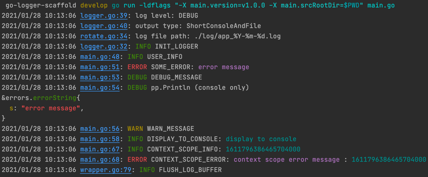

This repository has been archived. Use [zap-lightning](https://github.com/nkmr-jp/zap-lightning) instead.

# go-logger-scaffold

:rocket: Scaffolding for Easy setup that Json Logger and Log File Rotation to golang projects.

## Features

### Output json structured log to file.


- You can also output information about the number of lines in the file, the method, the host,
  and the git version. also version is can setting from go command.
- These can be useful for debugging
- Easily change the
  settings. ([logger/logger.go](https://github.com/nkmr-jp/go-logger-scaffold/blob/master/logger/logger.go#L32))
  .
- Since it is a json structure, you can use the `jq` command to extract only the data you need.
- Using [zap](https://github.com/uber-go/zap).

### Output simple log to console.

- It's hard to know what's going on when the console is flood with logs.
- The output to the console is minimal information.
- Display log level and message with color.
- It can jump to Code from GoLand console log. (this is why use the standard log for console log, not zap.)
- Using [log](https://pkg.go.dev/log).

### Log file rotation.
- Using [file-rotatelogs](https://github.com/lestrrat-go/file-rotatelogs).

## Install

```sh
go get -u github.com/nkmr-jp/go-logger-scaffold/logger
```

## How to use

Please refer to [main.go](main.go)

```go
package main

import (
	"github.com/nkmr-jp/go-logger-scaffold/logger"
	"go.uber.org/zap"
)

func main() {
	logger.InitLogger()
	defer logger.Sync() // flush log buffer

	logger.Info("USER_INFO", zap.String("name", "Alice"), zap.Int("age", 20))
}
```

### Options

following options can use.

Please refer to [main.go](main.go) and [logger/options.go](logger/options.go)

```go
logger.SetLogFile("./log/app_%Y-%m-%d.log")
logger.SetVersion(version)
logger.SetRepositoryCallerEncoder(urlFormat, version, srcRootDir)
logger.SetConsoleField(consoleField, traceIDField)
logger.SetLogLevel(zapcore.DebugLevel)
logger.SetOutputType(logger.OutputTypeShortConsoleAndFile)
```


## Output

### Console

```sh
$ go run main.go
2020/09/27 03:29:37 logger.go:26: [INFO] INIT_LOGGER
2020/09/27 03:29:37 main.go:10: [INFO] USER_INFO
```

### File

```sh
ls log/
app-2020-09-27_03.log
```

#### jq example

```sh
# jq command install
$ brew install jq

# Extract only [INFO]
$ tail -fq log/*.log | jq -R 'fromjson? | select(.level=="INFO")'
{
  "level": "INFO",
  "ts": "2020-09-27T03:29:37.063635+09:00",
  "caller": "logger/logger.go:26",
  "function": "github.com/nkmr-jp/go-zap-scaffold/logger.InitLogger.func1",
  "msg": "INIT_LOGGER",
  "version": "ff97115",
  "hostname": "MacBook-Pro-16-inch-2019.local"
}
{
  "level": "INFO",
  "ts": "2020-09-27T03:29:37.064071+09:00",
  "caller": "go-logger-scaffold/main.go:10",
  "function": "main.main",
  "msg": "USER_INFO",
  "version": "ff97115",
  "hostname": "MacBook-Pro-16-inch-2019.local",
  "name": "Alice",
  "age": 20
}
```

## Scaffolding (when you want to edit logger setting details)

```sh
cd [your-project-path]
curl -sSf https://raw.githubusercontent.com/nkmr-jp/go-logger-scaffold/master/scaffold.sh | sh
git add .
git commit -m "Create logger from https://github.com/nkmr-jp/go-logger-scaffold"
```

## Reference

* [zap package · pkg.go.dev](https://pkg.go.dev/go.uber.org/zap)
* [golangの高速な構造化ログライブラリ「zap」の使い方 - Qiita](https://qiita.com/emonuh/items/28dbee9bf2fe51d28153)
* [Adding Caller Depth support · Issue #715 · uber-go/zap · GitHub](https://github.com/uber-go/zap/issues/715)
* [logging - Is it possible to wrap log.Logger functions without losing the line number prefix? - Stack Overflow](https://stackoverflow.com/questions/42762391/is-it-possible-to-wrap-log-logger-functions-without-losing-the-line-number-prefi)
* [Time based log file rotation with zap — Dhwaneet Bhatt](https://dhwaneetbhatt.com/time-based-log-file-rotation-with-zap)
